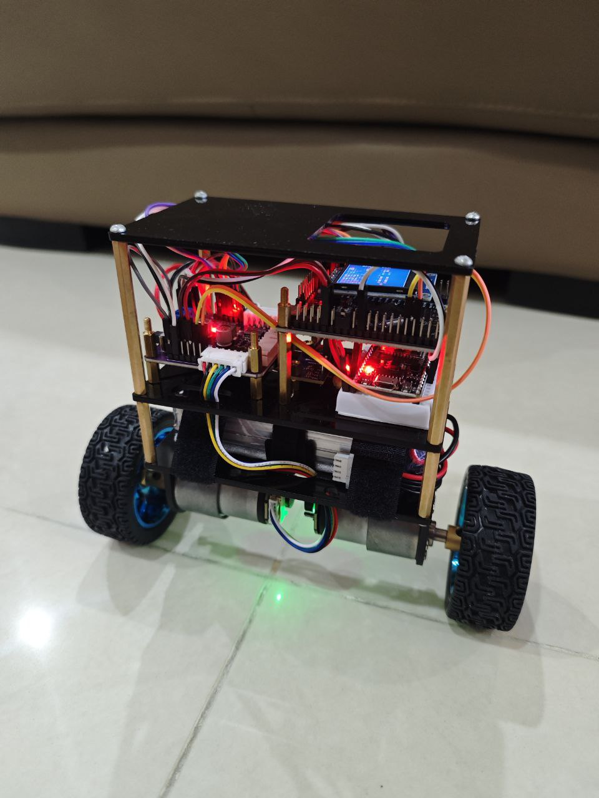

# STM32 Self-Balancing Robot



A self-balancing two-wheeled robot built around the **STM32F407VGT6**, featuring cascaded PID control with an inner motor speed loop and outer balancing loop — delivering aggressive disturbance rejection and precise pitch stabilisation.

---

## ✨ Features

- **Cascaded PID Control** — Inner motor speed loop tightly regulates wheel velocity; outer balancing loop commands speed setpoints to maintain upright posture
- **High-Torque Drive** — 12V JGB37-520 DC motors provide strong torque and a smaller deadzone for responsive, lag-free actuation
- **Safety Motor Lock** — When pitch angle exceeds ±60°, motors are immediately locked to prevent runaway movement and protect the robot and surroundings
- **Disturbance Rejection** — Robust to sudden external pushes and kicks; cascaded architecture recovers quickly without oscillation
- **On-board Display & Tuning** — Real-time telemetry and live PID parameter menu on a 1.3" ST7789 LCD
- **Stair Descent** — Stable enough to navigate downstairs under active balance control

---

## 🎬 Demo Videos
Click the picture to watch the video

| Video | Description |
|---|---|
| <a href="https://www.youtube.com/watch?v=OE3B0-bYBvg"></a> | Disturbance rejection & 60° pitch safety lock |
| <a href="https://www.youtube.com/watch?v=u2cGbBK3M_4"></a> | Agile movement demonstration |
| <a href="https://www.youtube.com/watch?v=dZx9JSyCDTw"></a> | Climbing down stairs |

---

## 🔧 Hardware

| Component | Details |
|---|---|
| **Microcontroller** | STM32F407VGT6 |
| **IMU** | BNO085 (pitch feedback) |
| **Motors** | 2× JGB37-520 DC Motor (12V, with encoder) |
| **Motor Driver** | TB6612FNG module |
| **Display** | 1.3" LCD (ST7789 driver) |
| **Battery** | 3S LiPo Battery |

---

## 🧠 Control Architecture

```
         ┌─────────────────────────────────────────────┐
         │                STM32F407VGT6                │
Encoder ──►  Measured Motor Speed                      │
ESP32   ──►  Velocity & Direction Command              │
BNO085  ──►  Pitch Angle Feedback                      │
         │           │  desired robot speed            │
         │    ┌──────▼──────┐                          │
         |    │ Motor Speed │  Outer loop:             │
         │    │  PID Loop   │                          │
         │    └──────┬──────┘                          │
         │           │  desired pitch angle            │
         │    ┌──────▼──────┐                          │
         │    │  Balancing  │  Inner loop:             │
         │    │  PID Loop   │  speed error → PWM duty  │
         │    └──────┬──────┘                          │
         │           │  desired PWM                    │
         │    ┌──────▼──────┐                          │
         │    │ Safety Lock │  |pitch| > 60° → lock    │
         │    └──────┬──────┘                          │
         └───────────┼─────────────────────────────────┘
                     │
              Motor Driver (TB6612)
                     │
                ┌────┴────┐
               M1 (L)   M2 (R)
```

### Cascaded PID Design

**Inner Loop — Motor Speed PID**
Encoder feedback closes a fast speed control loop around each motor. This linearises the plant seen by the outer loop and eliminates the deadzone of the JGB37-520, giving the balancing controller a predictable, responsive actuator.

**Outer Loop — Balancing PID**
The IMU pitch angle is compared against the upright setpoint. The resulting error drives a speed command fed into the inner loop. Because the inner loop tracks speed accurately, the outer tuning is decoupled from motor nonlinearities.

**Safety Motor Lock**
If pitch magnitude exceeds 60°, the robot has tipped beyond recoverable range. Both motors are immediately disabled (PWM zeroed, driver enabled pin pulled low) to prevent runaway wheel spin and mechanical damage.
